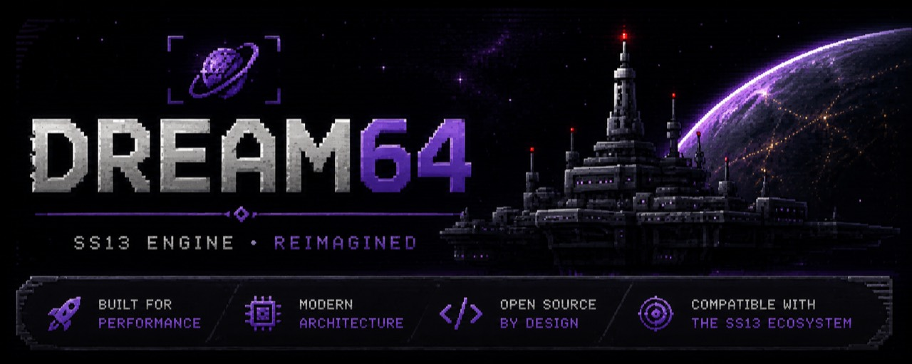

<p align="center">
  
</p>

# Dream64 engine

This directory is the clean-room implementation workspace for a 64-bit,
multicore-capable engine that accepts Dream Maker source code. The immediate
target is Monkestation's pinned BYOND 516.1663 behavior.

The project does not decode BYOND bytecode, copy proprietary implementation
details, or promise compatibility from syntax acceptance alone. Compatibility
is measured with public documentation and black-box fixtures that run through
both Dream Maker/Dream Daemon and this engine.

## Development status — August 2026

Dream64 has moved beyond isolated language fixtures and is now booting the real
MonkeStation 2.0 codebase far enough to attach its own native client. The client
loads the project's DMF skin, exchanges sequenced UI and input messages with the
server, fetches resources, decodes DMI sprites, and renders the first live lobby
screen objects. This is engine output—not a screenshot or a BYOND client embedded
inside Dream64.

The current lobby is not release-complete. Its assets are present, but several
BYOND-compatible composition rules still need work, including viewport scaling,
screen-plane positioning, layer ordering, transforms, and browser/UI readiness.
The result is recognizable and interactive at the protocol level, but some lobby
elements are still misplaced, clipped, or missing.

Current measured progress:

- The complete MonkeStation source graph compiles into a reusable Dream64
  artifact; a warm artifact load is currently about 9–10 seconds on the test
  machine.
- Compiler and server are separate processes. The compiler's incremental state
  remains in `dream64-cache`; each generation's deployable `.d64` contains executable
  bytecode and the bootstrap metadata needed by the server. A runtime launch
  never recompiles stale or missing input—it fails closed and asks the compiler
  process to rebuild.
- Production prewarming uses an explicit deployment identity and random seed,
  so station-map, ruin, room, and engine selection happen through the normal
  DM lifecycle and remain reproducible for that generation. The expensive map,
  atom, and subsystem stages are captured at a quiescent generation boundary.
  During handoff the client can reconnect to a read-only startup lobby while
  Dream64 resumes the final controller tail; interaction opens only after
  Monke's ticker enters pregame, preserving population-sensitive storyteller
  voting and the configured round countdown.
- The server and native client have a real loopback transport for attach,
  ordered UI batches and acknowledgements, resource transfer, map/screen
  appearances, input, and movement commands.
- The VM has adaptive scheduling, retained client display state, indexed world
  and associative-list lookups, cached initializer plans and DMI metadata, plus
  an experimental Cranelift JIT path for compatible code shapes.
- Expensive heap-independent atmosphere work has a worker lane. DM-visible
  mutation remains on one authoritative owner thread so datum IDs, globals,
  lists, RNG, constructors, and lifecycle ordering stay deterministic.
- The present bottleneck is MonkeStation's dynamic map and subsystem
  initialization. The latest bounded cold run reached its five-minute limit
  before the global `Initialize()` phase, so the sub-five-minute boot goal is
  **not achieved yet**.

The immediate release path is:

1. Finish BYOND-compatible lobby composition and browser-control readiness.
2. Extract pure map preparation into parallel worker batches, followed by a
   deterministic owner-thread commit.
3. Specialize the hottest exact mapping loops without changing DM-visible
   execution order.
4. Keep cold initialization isolated and low-impact, then make the player-facing
   restart a fast, validated hot-standby handoff.
5. Package reproducible 64-bit server and client builds without redistributing
   or loading proprietary BYOND DLLs.

## Current milestone

- A 64-bit-only core with an explicit 32-bit DM number representation.
- A loss-aware lexer for DM strings, raw text, line continuations,
	indentation, and exact source spans.
- A deterministic project loader that follows active includes, shared defines,
	nested conditionals, object/function macros, variadics, stringification,
	token pasting, original-source mapping, and the target compiler-version macros.
- A declaration parser that indexes paths, types, vars, procs, verbs,
	parameters, overrides, and opaque procedure bodies across the full active
	Monkestation source graph.
- A reusable compiler database that retains syntax by file identity, builds a
	project-wide object tree, and maps frontend diagnostics back to source spans.
- A typed, loss-aware DMF skin parser validated against Monkestation's real
	window, control, menu, and macro definitions.
- A lossless DMM parser validated across every Monkestation map, including
	typed value shapes and source-spanned per-atom variable assignments.
- A shared generational value heap for binary32 numbers, text, type paths,
	datums, and ordered positional/associative lists.
- Portable stack bytecode and a deterministic reference interpreter supporting
	explicit call frames, forward and recursive procedure calls, permissive DM
	argument arity, parameters, locals, assignment, arithmetic, comparisons,
	`if`/`else`, `while`, C-style `for`, `break`, and `continue`, with deterministic
	call-depth and instruction limits.
- A bounded reference-compiler runner for differential fixtures.
- A written compatibility boundary and runtime architecture.

Run the checks from this directory once Rust is installed:

```powershell
cargo test --workspace
cargo clippy --workspace --all-targets -- -D warnings
cargo fmt --all -- --check
```

Probe a fixture with a known-good Dream Maker executable:

```powershell
cargo run -p dm-conformance -- probe `
	--compiler "C:\path\to\byond\bin\dm.exe" `
	--project fixtures\compiler\basic\basic.dme
```

The temporary probe output is placed outside the fixture and removed after the
compiler exits. A timeout is treated as a distinct result rather than a failed
compatibility assertion.

Inspect the declaration tree produced for a DM source file:

```powershell
cargo run -p dm-conformance -- syntax path\to\source.dm
```

Inspect the deterministic file graph for a complete Dream Maker project:

```powershell
cargo run -p dm-conformance -- project path\to\world.dme
```

Load that graph and run declaration parsing across every DM source file:

```powershell
cargo run -p dm-conformance -- check path\to\world.dme
```

Build the combined frontend snapshot and object tree:

```powershell
cargo run -p dm-conformance -- frontend path\to\world.dme
```

Compile and execute a supported procedure through the reference interpreter:

```powershell
cargo run -p dm-conformance -- execute `
	fixtures\runtime\arithmetic.dm /proc/arithmetic_probe 4
```

Measure current bytecode-lowering coverage across a complete project:

```powershell
cargo run -p dm-conformance -- compile-check path\to\world.dme
```

Build a map allocation and execute the supported deterministic startup hooks:

```powershell
cargo run -p dm-lifecycle --bin dream64-compiler -- path\to\world.dme
cargo run -p dm-lifecycle --bin dream64-server -- boot path\to\world.d64 path\to\map.dmm
```

`dream64-compiler` never removes or relocates the `.dme` source tree. It writes
one sibling `.d64`; `dream64-server` can load that artifact without compiler
sources or private caches. The compiler reuses the whole artifact when the DME
graph is unchanged and reuses unchanged per-file syntax units after edits.

For an immutable deployment artifact, choose an explicit output path:

```powershell
dream64-compiler compile path\to\world.dme `
    --output target\dream64-generations\build-123\world.d64 `
    --reuse-artifact target\dream64-generations\build-122\world.d64
```

`--reuse-artifact` is validated against the current source fingerprint. When
the source graph is unchanged, Dream64 hard-links (or copies) the already
validated artifact instead of lowering the whole executable again.

### Background compile and hot-generation safety

Run the development deployment watchdog with:

```powershell
powershell -ExecutionPolicy Bypass -File scripts\watch-and-prewarm.ps1 `
    -BuildImmediately
```

The watchdog debounces relevant Monke source/resource changes, invokes the
separate compiler, starts the resulting generation at below-normal priority,
and waits for its isolated prewarm readiness signal. Only then does it atomically
publish `target\dream64-generations\current.json`. A failed compile or prewarm
leaves the current pointer unchanged.

Generation artifacts are immutable. Dream64 never deletes or overwrites the
`.d64` used by a running round. Activation writes a generation lease before the
handoff; the watchdog preserves that generation while its server PID is alive,
then removes its artifact and preparation logs after exit. Superseded standbys
that were never activated are cancelled. The steady state therefore retains
only the active generation and its selected replacement. This model
also provides a stable adapter boundary for TGS: TGS can stage a unique game
directory, invoke the compiler, prewarm it, and switch generations without
mutating the active game directory.

This currently runs the supported `New()`, `Initialize()`, and
`LateInitialize()` bodies against the allocated `/world`, areas, turfs, and
movables. The output is a deterministic startup summary and then enters an
optional persistent scheduler loop for headless runtime work; set
`DREAM64_BOOT_MAX_SLICES` to terminate the loop after a fixed number of
iterations for deterministic smoke runs.

Preview a compiled project's lobby through the loopback client protocol:

```powershell
target\release\dream64-server.exe lobby-preview path\to\world.dme no-init
target\release\dm-client.exe --skin path\to\skin.dmf
```

The client can capture that protocol session—including ordered UI commands,
map/screen appearances, and fetched resources—and replay it later without a
running world:

```powershell
target\release\dm-client.exe --skin path\to\skin.dmf `
    --record-replay lobby.d64r

target\release\dm-client.exe --skin path\to\skin.dmf `
    --replay lobby.d64r
```

Replay files are local development artifacts. Playback validates required
commands, serves recorded responses by command, and turns exhausted UI polling
into an idle empty batch so a captured lobby remains open offline.
